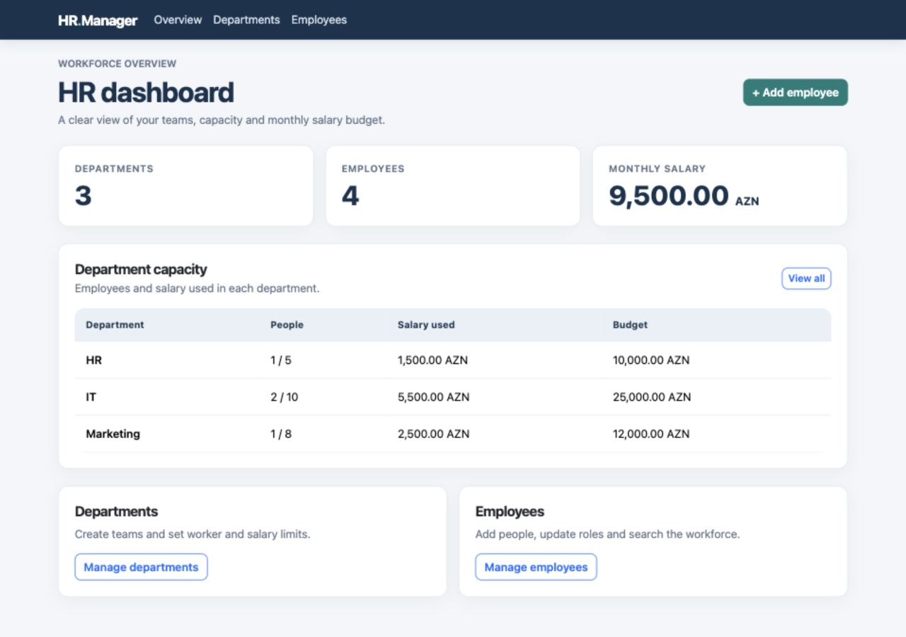
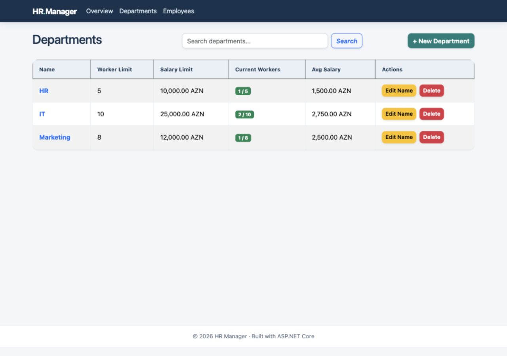

# HR Management App

A small, portfolio-ready HR management application built with ASP.NET Core MVC, Entity Framework Core, and PostgreSQL. It helps manage departments, employees, team capacity, and monthly salary budgets.

## Features

- Create, rename, search, and delete departments.
- Add, edit, search, and delete employees.
- Enforce a worker limit and salary budget for each department.
- Keep department names unique without case sensitivity.
- Generate stable employee numbers such as `IT1001`.
- Show workforce and salary totals on a dashboard.
- Load demo departments and employees into a new database.

Deleting a department also deletes its employees. The interface asks for confirmation before that action.

## Screenshots

These screenshots were captured from the running Docker Compose app with its demo data.






## Tech stack

| Area | Choice |
| --- | --- |
| Runtime | .NET 10 / ASP.NET Core MVC |
| Persistence | Entity Framework Core / Npgsql |
| Database | PostgreSQL |
| UI | Razor views and responsive CSS |
| Testing | .NET test suite |
| Delivery | Docker, Docker Compose, GitHub Actions, GHCR |

## Quick start

Install Docker Desktop (or Docker Engine with Compose). Download [compose.published.yaml](compose.published.yaml) to an empty folder, then run in that folder:

```bash
docker compose -f compose.published.yaml up -d
```

Open **http://localhost:8080**. Docker pulls the published app image and PostgreSQL image; no .NET SDK, source checkout, or registry login is needed. On first start, Compose generates a random database password inside a Docker-managed credential volume. Each installation keeps its own database and credential volumes locally; neither is included in the public image or repository.

To stop it, run `docker compose -f compose.published.yaml down` in the same folder. Do not add `-v` unless you intend to delete both the local database and its credential.

### Updating an older Docker installation

The previous Compose file used a different database password. If you already have a database volume from that version, the new generated credential will not match it. Keep your data by stopping the old stack, starting just the database with the new Compose file, and rotating its `hrapp` password from inside the database container:

```bash
docker compose -f compose.published.yaml down
docker compose -f compose.published.yaml up -d db
docker compose -f compose.published.yaml exec -T db sh -ec 'printf "ALTER ROLE hrapp WITH PASSWORD '\''%s'\'';\n" "$(cat /run/secrets/postgres_password)" | psql -v ON_ERROR_STOP=1 -U hrapp -d hrmanagement'
docker compose -f compose.published.yaml up -d
```

Use `compose.yaml` in place of `compose.published.yaml` if you run from source. The command reads the new credential inside the container; it does not print the password. Do not use `down -v` for an upgrade, as that deletes your existing data.

### Build from source with Docker

Install Docker with the Compose plugin, then run from the repository root:

```bash
docker compose up --build
```

Open **http://localhost:8080**. The first start generates a random local database password, applies the database migration, and adds demo data automatically. The PostgreSQL data and credential are stored in Docker volumes and remain available after `docker compose down`.

This command builds the application image from source on your computer; no registry account is needed. It does not publish the image or deploy a public website.

To stop the containers:

```bash
docker compose down
```

To deliberately remove the local database and start over, run `docker compose down -v`. This deletes both the Compose database and credential volumes.

## Demo workflow

1. Open the dashboard to review workforce, department and salary totals.
2. Browse departments to see worker limits and salary budgets.
3. Add or edit an employee and observe the updated totals.
4. Try a capacity or budget limit to see the validation rule.

## Development

The project targets .NET 10. With the .NET 10 SDK installed:

```bash
dotnet restore HRManagementApp.slnx
dotnet build HRManagementApp.slnx --no-restore
```

Running the web app directly also requires a PostgreSQL database. Set `ConnectionStrings__DefaultConnection` in your environment, then run `dotnet run --project src/HRManagementApp/HRManagementApp.csproj`. Docker Compose provides this setting automatically.

The app applies migrations when it starts. Demo data is inserted only when the database has no departments. Never put database passwords in tracked `appsettings` files.

## Tests

```bash
dotnet test HRManagementApp.slnx --no-restore
```

GitHub Actions checks the .NET build, tests, and Docker image build on each push or pull request.

## Architecture

```text
HRManagementApp.slnx
src/
  HRManagementApp/             ASP.NET Core MVC controllers, views, and static assets
  HRManagementApp.Core/        Entities and service contract
  HRManagementApp.Business/    HR rules, DTOs, and validators
  HRManagementApp.DataAccess/  EF Core context, PostgreSQL provider, and migration
tests/
  HRManagementApp.Tests/       Rule and validation tests
Dockerfile
compose.yaml
compose.published.yaml
```

## Security and scope

This repository is a local portfolio demo. It has no login or role system and must not be used for real employee data or exposed to the internet. The Docker Compose app port is bound to localhost; the PostgreSQL port is not published. The source repository and container image are public, but an installation's database volume and generated password are local to its Docker host.

## Deployment

The image is published to GitHub Container Registry for local use with Compose. A public web deployment is coming later.
