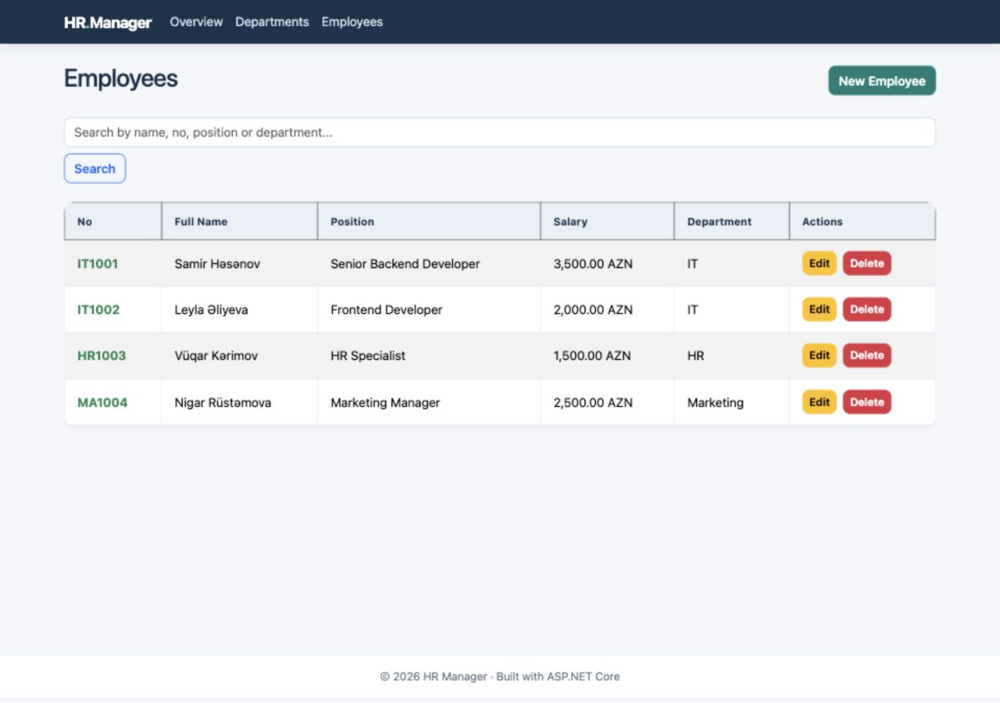

# HR Management App

A small, portfolio-ready HR management application built with ASP.NET Core MVC, Entity Framework Core, and PostgreSQL. It helps manage departments, employees, team capacity, and monthly salary budgets.

## What it does

- Create, rename, search, and delete departments.
- Add, edit, search, and delete employees.
- Enforce a worker limit and salary budget for each department.
- Keep department names unique without case sensitivity.
- Generate stable employee numbers such as `IT1001`.
- Show workforce and salary totals on a dashboard.
- Load demo departments and employees into a new database.

Deleting a department also deletes its employees. The interface asks for confirmation before that action.

## Screenshots

These screenshots were captured from the running Docker Compose app with its demo data.




## Run the published image

Install Docker Desktop (or Docker Engine with Compose). Download [compose.published.yaml](compose.published.yaml) to an empty folder, then run in that folder:

```bash
docker compose -f compose.published.yaml up -d
```

Open **http://localhost:8080**. Docker pulls the published app image and PostgreSQL image; no .NET SDK, source checkout, or registry login is needed for a public image. The database persists in a named Docker volume. The Compose file is for a localhost demo and uses a known default database password: set `POSTGRES_PASSWORD` in a local `.env` file before starting if you want a different password. Do not expose this demo stack to the internet.

To stop it, run `docker compose -f compose.published.yaml down` in the same folder. Do not add `-v` unless you intend to delete your local database.

## Build from source with Docker

Install Docker with the Compose plugin, then run from the repository root:

```bash
docker compose up --build
```

Open **http://localhost:8080**. The first start applies the database migration and adds demo data automatically. The PostgreSQL data is stored in a Docker volume and remains available after `docker compose down`.

This command builds the application image from source on your computer; no registry account is needed. It does not publish the image or deploy a public website.

The Compose file includes a password for local demonstration. To use your own local password, copy `.env.example` to `.env` and change `POSTGRES_PASSWORD` before starting the stack. Do not reuse the demo password for a public deployment.

To stop the containers:

```bash
docker compose down
```

To deliberately remove the local database and start over, run `docker compose down -v`. This deletes the Compose database volume and its data.

## Project structure

```text
HRManagementApp.slnx
src/
  HRManagementApp/             ASP.NET Core MVC controllers, views, and static assets
  HRManagementApp.Core/        Entities and service contract
  HRManagementApp.Business/    HR rules, DTOs, and validators
  HRManagementApp.DataAccess/  EF Core context, PostgreSQL provider, and migration
tests/
  HRManagementApp.Tests/       Rule and validation tests
Dockerfile
compose.yaml
```

## Build and test locally

The project targets .NET 10. With the .NET 10 SDK installed:

```bash
dotnet restore HRManagementApp.slnx
dotnet build HRManagementApp.slnx --no-restore
dotnet test HRManagementApp.slnx --no-restore
```

Running the web app directly also requires a PostgreSQL database. Set `ConnectionStrings__DefaultConnection` in your environment, then run `dotnet run --project src/HRManagementApp/HRManagementApp.csproj`. Docker Compose provides this setting automatically.

The app applies migrations when it starts. Demo data is inserted only when the database has no departments. Never put database passwords in tracked `appsettings` files.

## Current scope

This repository is a local portfolio demo. It has no login or role system. The Docker Compose port is bound to localhost so the demo is not exposed to the network by default. GitHub Actions checks the .NET build, tests, and Docker image build on each push or pull request.

## Deployment

The image is published to GitHub Container Registry for local use with Compose. A public web deployment is coming later.
