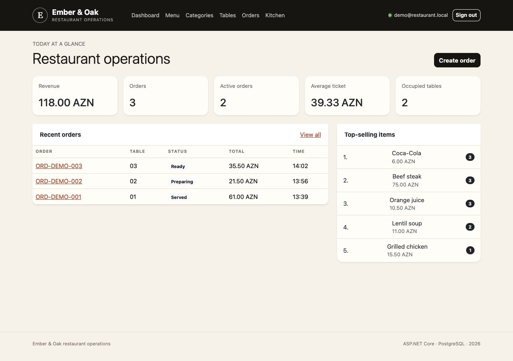

# Project — .NET Application Portfolio

Two independent ASP.NET Core applications in one repository. Each project has its own solution, Docker setup, tests, and detailed README. This page is a guide to the collection; choose an application below to explore its features or run it locally.

| | [HR Management App](HRManagementApp/README.md) | [Ember & Oak — Restaurant Operations](RestoranApp/README.md) |
|---|---|---|
| Purpose | Manage departments, employees, capacity, and salary budgets. | Coordinate menus, tables, orders, kitchen work, and reporting. |
| Highlights | Workforce dashboard, employee numbers, department limits, demo data. | Role-based access, order price snapshots, kitchen workflow, operational dashboard. |
| Foundation | .NET 10, ASP.NET Core MVC, EF Core, PostgreSQL. | .NET 10, ASP.NET Core MVC, EF Core, PostgreSQL. |
| Local delivery | Docker Compose or the .NET SDK with PostgreSQL. | Docker Compose or the .NET SDK with PostgreSQL. |

## A look inside

| HR Management | Restaurant Operations |
|:---:|:---:|
|  |  |
| [Features, setup, architecture, and tests →](HRManagementApp/README.md) | [Features, setup, architecture, and tests →](RestoranApp/README.md) |

## Getting started

Both applications can run with Docker Compose. They each use port `8080`, so run one at a time unless you change the host port. Commands are run inside the selected project directory, not from this repository root.

**HR Management App** generates its local database credential during first startup:

```bash
cd HRManagementApp
docker compose up --build -d
```

Open `http://localhost:8080`. See the [HR setup guide](HRManagementApp/README.md#quick-start) for the published-image option, development commands, and data-volume notes. This app has no login system and is intended for local demonstration, not real employee data.

**Ember & Oak** requires two distinct locally generated passwords before startup:

```bash
cd RestoranApp
cp .env.example .env
```

Follow the [restaurant setup guide](RestoranApp/README.md#quick-start) to fill in `.env` and start the stack. Do not commit the local `.env` file. The restaurant app uses staff roles; its README covers the demo login and workflows.

## Repository map

```text
Project/
├── HRManagementApp/        HR application, solution, tests, and Docker files
├── RestoranApp/            Restaurant application, solution, tests, and Docker files
└── .github/workflows/      Container publishing workflows for each application
```

The projects are intentionally separate: there is no root-level .NET solution or shared database. Each directory contains its own implementation notes, screenshots, test commands, and security considerations. Repository-level GitHub Actions workflows publish the corresponding container image when that project's files change on `main`.

## Scope and licensing

These are portfolio and learning applications; this repository documents local usage rather than a public web deployment. Review each project's security notes before using it beyond a local demo. The restaurant project includes an [MIT license](RestoranApp/LICENSE); the HR project does not include a separate license file.
