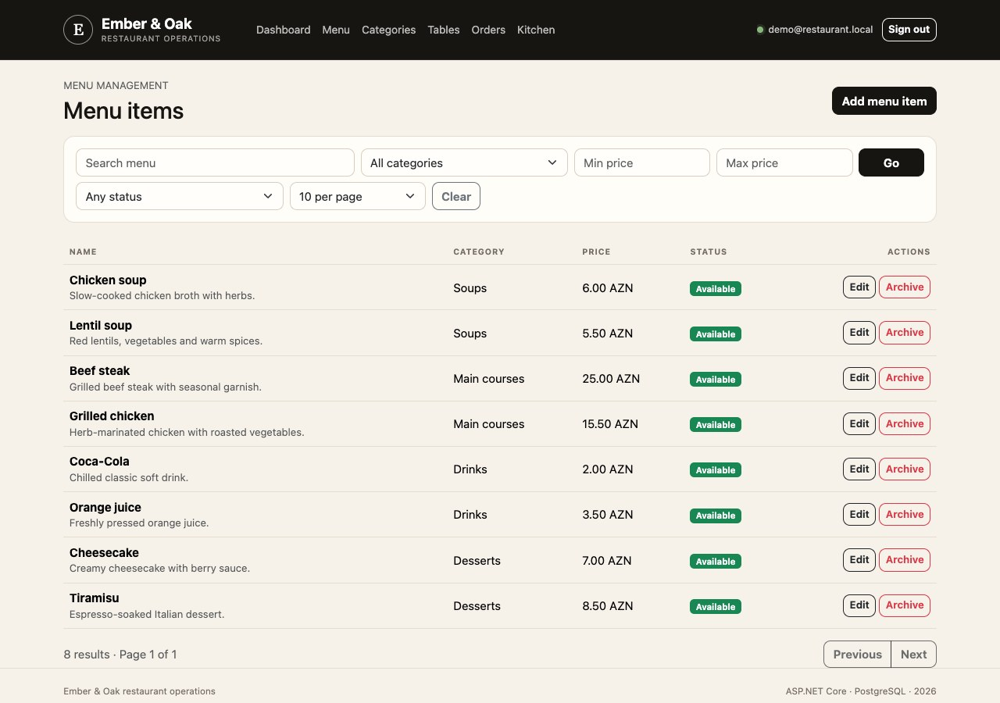
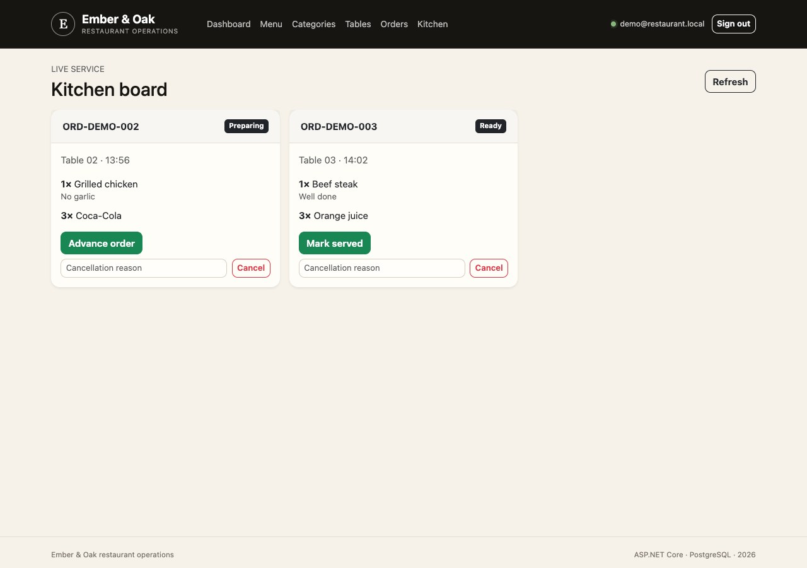

# Ember & Oak — Restaurant Operations


A portfolio-ready ASP.NET Core MVC application that models a restaurant's daily operating flow: menu setup, table service, transactional order creation, kitchen fulfilment and management reporting.

The project focuses on business rules and production-minded engineering rather than simple CRUD. Prices are snapshotted when an order is created, order transitions are controlled by the domain, cancellations preserve history, staff access is role-based, and the PostgreSQL schema is verified with container-backed integration tests.

## Features

- Layered .NET solution with explicit Domain, Application, Infrastructure and Web projects
- ASP.NET Core Identity with `Admin`, `Manager`, `Waiter` and `Kitchen` roles
- Menu, category and dining-table administration with archive/availability rules
- Transactional order creation with server-side price calculation
- Kitchen board workflow: `Pending → Preparing → Ready → Served`
- Operational dashboard with revenue, order, ticket and table KPIs
- Search, combined filters and server-side pagination
- PostgreSQL migrations, constraints and idempotent demo seed data
- Global error handling, antiforgery validation and defensive HTTP headers
- Unit tests plus real PostgreSQL integration tests through Testcontainers
- Non-root multi-stage Docker image and health-checked Compose stack
- GitHub Actions for build, tests, image verification and GHCR publishing

## Screenshots

Captured from the running local Docker Compose app with demo orders.






## Tech stack

| Area | Choice |
| --- | --- |
| Runtime | .NET 10 / ASP.NET Core MVC |
| Persistence | Entity Framework Core 10 / Npgsql |
| Database | PostgreSQL 17 |
| Authentication | ASP.NET Core Identity |
| UI | Razor views, Bootstrap, custom responsive CSS, JavaScript |
| Testing | xUnit, Testcontainers for .NET |
| Delivery | Docker, Docker Compose, GitHub Actions, GHCR |

## Quick start

You need Docker Desktop or another Docker Engine with Compose support.

1. Create your local environment file:

   ```bash
   cp .env.example .env
   ```

2. Generate two different values with `openssl rand -base64 32` and place them in `.env` as `POSTGRES_PASSWORD` and `RESTAURANT_ADMIN_PASSWORD`. The administrator password must contain uppercase, lowercase, number and symbol characters.

3. Start the stack:

   ```bash
   docker compose up --build --detach --wait
   ```

4. Open [http://localhost:8080](http://localhost:8080) and sign in with `RESTAURANT_ADMIN_EMAIL` from `.env` (defaults to `admin@restaurant.local`) and your generated administrator password.

The first startup applies the migration, creates the four staff roles, provisions the configured administrator, and seeds four categories, eight menu items and twelve dining tables. No password or usable default credential is committed to the repository.

Check readiness or stop the local stack with:

```bash
curl --fail http://localhost:8080/health
docker compose down
```

Add `--volumes` to the down command only when you deliberately want to delete the local database.

## Demo workflow

1. Sign in and review today's KPIs on the dashboard.
2. Open **Menu** and demonstrate category filters, availability and safe item archiving.
3. Open **Tables** and review active capacity and occupancy.
4. Create an order for a free table, select dishes, add a kitchen note and confirm the calculated total.
5. Open **Kitchen** and advance the ticket from pending through served.
6. Return to **Orders** to show the saved price snapshot, filters and retained history.

The bootstrapped administrator can demonstrate every workflow. Additional staff accounts can be assigned the Manager, Waiter or Kitchen role through ASP.NET Core Identity when integrating the application with an organisation's user-provisioning process.

## Development

Prerequisites:

- .NET SDK `10.0.401` or a compatible later 10.0 patch
- PostgreSQL 17
- Docker for the integration test project

Configure the application with environment variables or an ignored `src/RestaurantApp.Web/appsettings.Mac.json` file. The required configuration keys are:

| Key | Purpose |
| --- | --- |
| `ConnectionStrings__DefaultConnection` | Npgsql connection string |
| `BootstrapAdmin__Email` | Optional initial administrator email |
| `BootstrapAdmin__Password` | Optional initial administrator password |
| `BootstrapAdmin__DisplayName` | Optional display name |

Then restore, build and run:

```bash
dotnet restore RestaurantApp.sln
dotnet build RestaurantApp.sln --configuration Release --no-restore
dotnet run --project src/RestaurantApp.Web/RestaurantApp.Web.csproj
```

Database migrations and seed data are applied during startup. The repository-pinned EF CLI can also inspect migration state:

```bash
dotnet tool restore
dotnet ef migrations list \
  --project src/RestaurantApp.Infrastructure/RestaurantApp.Infrastructure.csproj \
  --startup-project src/RestaurantApp.Web/RestaurantApp.Web.csproj
```

## Tests

Run the complete test suite from the repository root:

```bash
dotnet test RestaurantApp.sln --configuration Release
```

The integration project starts an isolated `postgres:17-alpine` container with a random runtime password. It verifies migrations and seed data, persists an order graph with its price snapshot, and checks a database constraint. Docker must be running for these tests.

Every push to `main` or `portfolio-restaurant` and every pull request to `main` runs:

- dependency restore and warning-free Release build;
- eight domain/application unit tests;
- three PostgreSQL integration tests;
- a clean Docker image build.

Pushes to `main` and version tags also publish signed, SBOM-enabled AMD64/ARM64 images to GitHub Container Registry.

## Architecture

```text
src/
├── RestaurantApp.Domain/          # Entities, value rules, order state machine
├── RestaurantApp.Application/     # Use cases, DTOs, ports, queries and policies
├── RestaurantApp.Infrastructure/  # EF Core, Identity, repositories, migrations
└── RestaurantApp.Web/             # MVC controllers, Razor UI, composition root
tests/
├── RestaurantApp.UnitTests/
└── RestaurantApp.IntegrationTests/
```

See [Architecture and design decisions](docs/architecture.md) for dependency direction, request flow, persistence decisions and security boundaries.

## Security and scope

- All state-changing MVC actions receive automatic antiforgery validation.
- Identity cookies are HTTP-only, same-site and protected by account lockout rules.
- Role checks are applied at controller boundaries.
- Content Security Policy, frame denial, MIME sniffing protection and restrictive browser permissions are enabled.
- The image runs as the .NET base image's non-root user.
- Compose requires local secrets and does not contain fallback passwords.
- Detailed unexpected errors stay in server logs; clients receive safe Problem Details responses with a trace identifier.

For a public deployment, terminate TLS at a trusted reverse proxy, use a managed secret store, protect persisted Data Protection keys, restrict database exposure, and replace bootstrap provisioning with the organisation's identity lifecycle.

## License

This project is available under the [MIT License](LICENSE).
