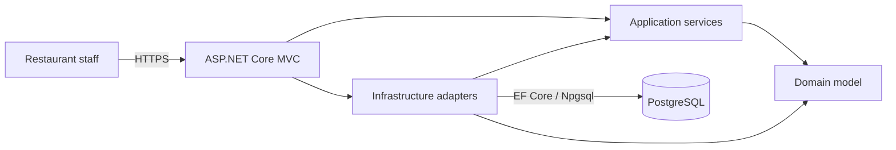
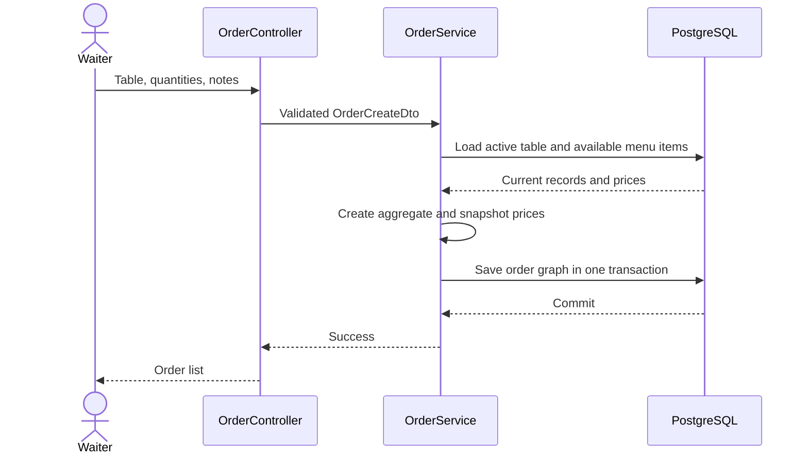
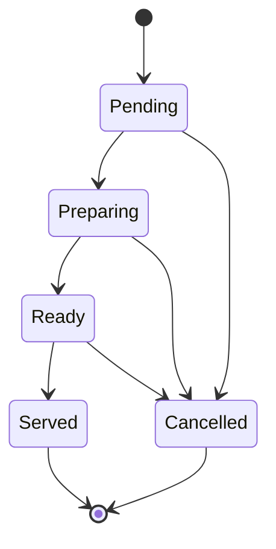

# Architecture and design decisions

## System context

Ember & Oak is a server-rendered web application for restaurant staff. ASP.NET Core MVC owns the HTTP and UI boundary, Application services coordinate use cases, Domain entities enforce order rules, and Infrastructure adapts those use cases to PostgreSQL and ASP.NET Core Identity.

## Layer responsibilities

| Project | Owns | Depends on |
| --- | --- | --- |
| `RestaurantApp.Domain` | Entities, audit fields, order status rules and price snapshots | Nothing |
| `RestaurantApp.Application` | DTOs, service contracts, repository ports, use cases, queries and pagination | Domain, EF query abstractions |
| `RestaurantApp.Infrastructure` | DbContext, entity configuration, repositories, transactions, Identity, migrations and seed data | Application, Domain |
| `RestaurantApp.Web` | Authentication boundary, controllers, Razor views, middleware and dependency composition | Application, Infrastructure, Domain |

The Domain project does not reference EF Core or ASP.NET Core. Repository and transaction abstractions are defined toward the Application layer; Infrastructure provides their concrete implementations.

## Order creation

The browser's estimated total is informational. `OrderService` reloads menu items from the database and the `Order` aggregate calculates the authoritative total from server-side prices. Each `OrderItem` keeps its unit price so later menu edits do not rewrite sales history.

## Kitchen lifecycle

Invalid transitions are rejected by the Domain model. Served or already-cancelled orders cannot be cancelled, and cancellations retain the record, reason and timestamp.

## Persistence

- EF Core configurations define lengths, precision, relationships, indexes and check constraints.
- PostgreSQL migrations are versioned under the Infrastructure project.
- Startup migration and seed operations are idempotent for local/demo use.
- The unit of work wraps order creation in a database transaction.
- Integration tests use a disposable PostgreSQL 17 container rather than an in-memory provider, so SQL types, migrations and constraints are exercised.

## Identity and authorization

The application creates four roles:

| Role | Access |
| --- | --- |
| Admin | All operational and management screens |
| Manager | Menu, categories, tables, orders and kitchen workflow |
| Waiter | Dashboard and order workflow |
| Kitchen | Dashboard and kitchen/order workflow |

Only an administrator supplied through runtime configuration is bootstrapped. Credentials are never defined in source. Controller-level role policies remain the authoritative access boundary; hiding a navigation item is only a user-interface convenience.

## Runtime and delivery

The Dockerfile restores and publishes in the SDK stage, then copies only the published output into the ASP.NET runtime image. The final process uses UID 1654, includes an HTTP healthcheck, and persists Data Protection keys in a dedicated volume. Compose waits for PostgreSQL readiness before starting the web service and requires both database and administrator passwords.

GitHub Actions separately verifies the .NET solution and container build. The release workflow produces AMD64 and ARM64 images, OCI provenance, an SBOM and a registry attestation.

## Production considerations

The Compose file is intentionally a secure local/demo baseline, not a complete cloud topology. A production environment should additionally provide:

- TLS termination and trusted forwarded-header configuration;
- a secret manager and regular credential rotation;
- encrypted, access-controlled Data Protection key storage;
- a private database network with backups and recovery testing;
- central logs, metrics, traces and alerts;
- external identity lifecycle or an audited staff administration flow;
- a deployment strategy that runs migrations as a controlled release step.
