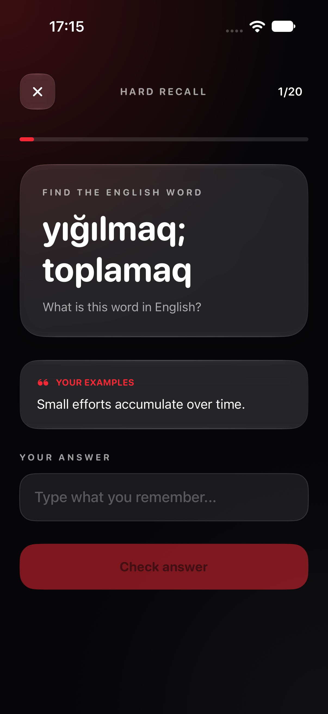
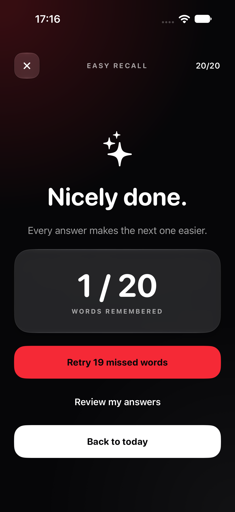
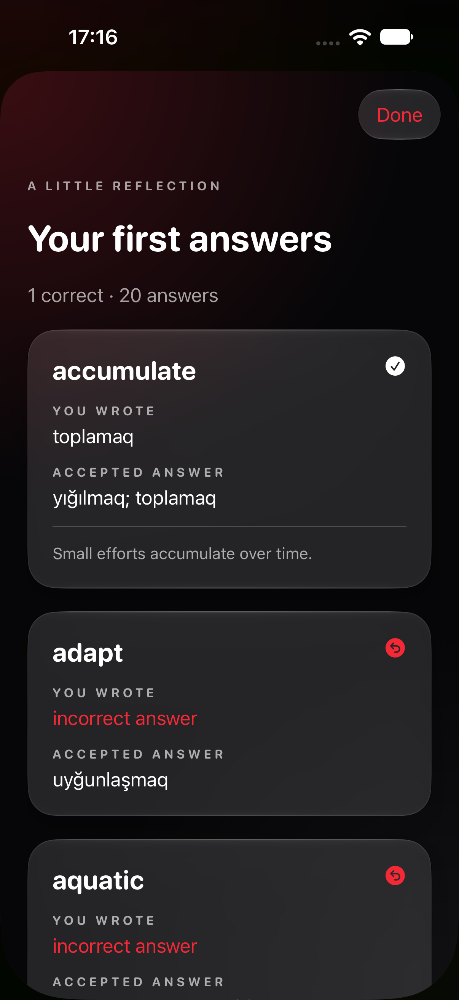
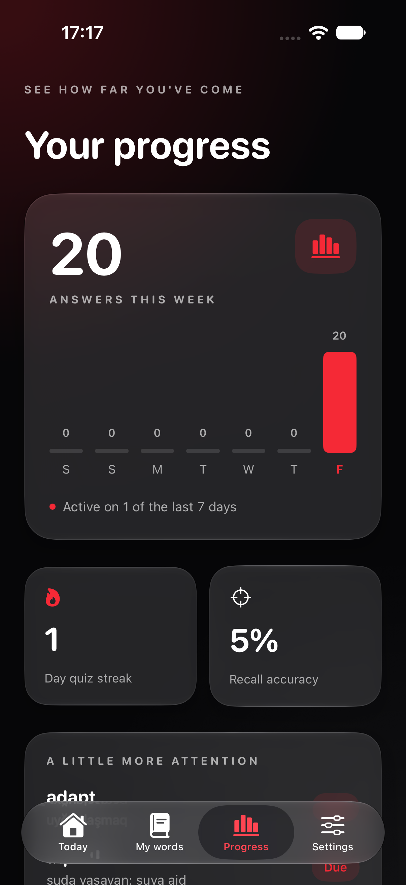

# WordRevisit

An offline iPhone vocabulary app for practising English and Azerbaijani with short, focused quizzes. The first launch contains 59 English words and their Azerbaijani translations. Words, results, and reminder settings stay on the device.

Current version: **1.2.0**. Add your own example sentences, review every answer, retry missed words, and follow your progress with spaced reviews. Existing words and quiz history are preserved when updating the same installation.

## Screenshots

Captured from version 1.2.0 running in the iPhone 18 Pro simulator on iOS 27, using demo learning data. The interface uses Liquid Glass on iOS 26 and later, with a native material fallback on earlier supported releases.

| Today | My words | Quiz | Settings |
|:---:|:---:|:---:|:---:|
|  |  |  |  |

| Hard recall with examples | Results and retry | Answer review | Progress |
|:---:|:---:|:---:|:---:|
|  |  |  |  |

## Features

- **Easy recall:** English word → type its Azerbaijani translation.
- **Hard recall:** Azerbaijani translation → type the English word.
- Azerbaijani answers work with or without Azerbaijani keyboard characters.
- Up to 20 new or due words per quiz, with difficult words selected first. The question list stays fixed throughout a quiz.
- Spaced reviews after 1, 3, 7, 14, and 30 days of successful recall.
- A results review shows each question, your answer, and accepted translations. Reopen saved reviews from Progress.
- Retry just the words you missed, without changing your first score or review dates.
- Progress includes a seven-day activity chart, quiz streak, accuracy, difficult words, and recent quizzes.
- Add, edit, delete, and search words. Optional definitions appear after a quiz answer.
- Write your own example sentences in the word editor. They appear as visible hints in both quiz modes and are never graded.
- Import and export words and examples as CSV. A semicolon separates accepted alternative translations.
- Two optional local notifications each day, with times chosen in Settings. No server or account is needed.
- An optional Xcode renewal reminder six days after you mark an install in Settings.
- Light, Dark, and Tinted Home Screen icon variants on iOS 18 and later.
- A centered logo appears during the system launch screen; iOS controls how long it remains visible.

## Your learning routine

Open **My words**, choose a word, and fill in **Example sentences**. You can write several sentences on separate lines. In Easy recall you still answer with the Azerbaijani translation; in Hard recall you answer with the English word. Examples are visible in both directions, even if a sentence contains the answer.

After a quiz, **Review my answers** shows the original answers. **Retry missed words** starts a shorter round containing only mistakes; you can repeat it if needed. The original result is saved once, and retries do not inflate your accuracy or advance the word's review schedule.

A correct scheduled answer moves the next review out by 1, 3, 7, 14, then 30 calendar days. A wrong answer resets the interval and makes the word due again. Easy and Hard share the same word schedule. When no words are due, quizzes become **extra practice**: answers still count in a completed quiz, but review dates stay unchanged.

The Progress chart covers the last seven local calendar days. Streaks count consecutive days with a completed quiz; yesterday's streak stays active until today ends. Incomplete quizzes update word practice and review dates, but only completed quizzes appear in activity totals and accuracy. Older quiz scores remain visible, while detailed answer reviews are available for quizzes completed in 1.2.0 or later.

## CSV format

CSV is a plain-text table that you can also edit in a spreadsheet app:

```csv
English,Azerbaijani,Definition,Examples
fell,ağacı kəsmək; ağac kəsmək,To cut down a tree.,They fell old trees.
```

The first two columns are required. Definition and Examples are optional; old two- and three-column files still work. Quotes, commas, and multiple lines in examples are supported by export/import. CSV exports vocabulary, including examples, but not quiz history or review dates. Import adds new word/translation pairs; it does not overwrite existing entries.

## Run on an iPhone without the App Store

Requirements: a Mac with Xcode 26 or later, an iPhone running iOS 18 or later, a cable, and a free Apple Account.

1. Open `WordRevisit.xcodeproj` in Xcode.
2. In **Xcode → Settings → Accounts**, sign in with your Apple Account.
3. Select the **WordRevisit** target. Under **Signing & Capabilities**, enable **Automatically manage signing**, choose your **Personal Team**, and change the bundle identifier if Xcode asks for a unique one.
4. Connect and unlock your iPhone, select **Trust This Computer** if prompted, and enable **Settings → Privacy & Security → Developer Mode** on the phone if needed.
5. Choose your named iPhone as the Xcode run destination (not **Any iOS Device**) and press **Run** (`⌘R`). Xcode registers the phone and creates its development provisioning profile.
6. If iOS blocks the installed app, open **Settings → General → VPN & Device Management**, select your developer account, and trust its certificate. Follow any restart prompt, then open WordRevisit again.

If Xcode says **“Your team has no devices from which to generate a provisioning profile”**, check that the iPhone appears under **Window → Devices and Simulators**, is unlocked and trusted, and is selected as the run destination. Keep **Automatically manage signing** enabled and select your own Personal Team. If Xcode reports a bundle ID conflict, choose a unique bundle identifier for your copy.

The free Personal Team profile expires after **7 days**. Run the project from Xcode again to renew it. Export your words before removing the app or changing its bundle identifier. See [Apple's device-run guide](https://developer.apple.com/documentation/xcode/running-your-app-on-simulated-or-physical-devices) and [free-account limits](https://developer.apple.com/help/account/basics/about-your-developer-account).

For a heads-up, turn on **Xcode renewal** in Settings. The app sends one local notification six days after the date you enable it or tap **I reinstalled from Xcode**. Tap that button after each successful reinstall. The reminder is an estimate because the app does not inspect your provisioning profile; it cannot renew the install for you.

## Code map

```text
Sources/
├── Models/      Word data, quiz sessions, answer history, and progress calculations
├── Data/        Local JSON persistence and quiz history
├── Services/    Review scheduling, quiz selection, CSV, and local notifications
└── Views/       SwiftUI screens and visual style
```

The project uses SwiftUI, Foundation, and UserNotifications. There are no external packages, accounts, or cloud services. To run the small logic check on a Mac:

```bash
swiftc Sources/Models/*.swift Sources/Services/*.swift Tests/LogicChecks.swift -o /tmp/WordRevisitLogicChecks
/tmp/WordRevisitLogicChecks
swiftc Sources/Models/*.swift Sources/Services/*.swift Sources/Data/WordRepository.swift Tests/RepositoryChecks.swift -o /tmp/WordRevisitRepositoryChecks
/tmp/WordRevisitRepositoryChecks
```

The checks cover legacy JSON/CSV, sentence round trips, review intervals, day boundaries, duplicate submissions, missed-word retries, and persistence. In Xcode, select an iPhone simulator and choose **Product → Test** (`⌘U`) to run the quiz UI regression. UI tests use a separate temporary data file in Debug builds, leaving your normal vocabulary untouched.

## License

MIT. See [LICENSE](LICENSE).
