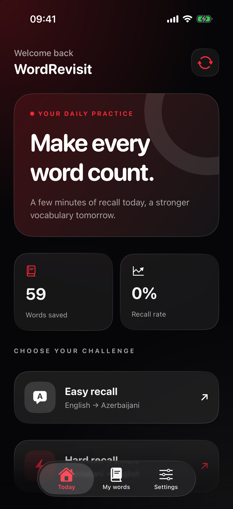
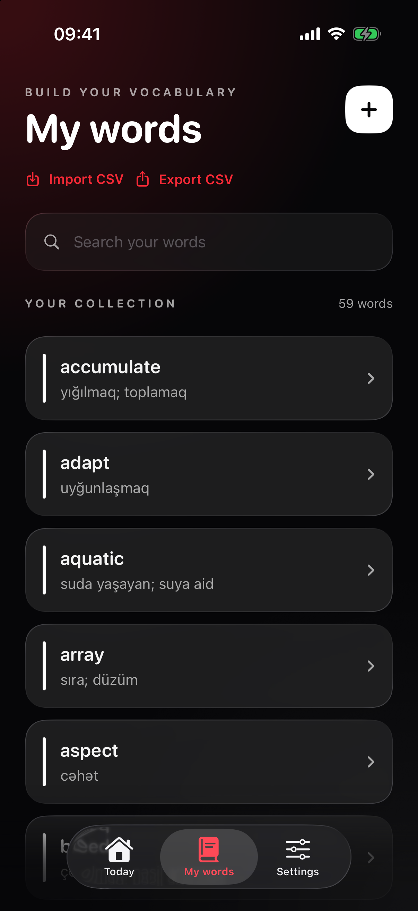
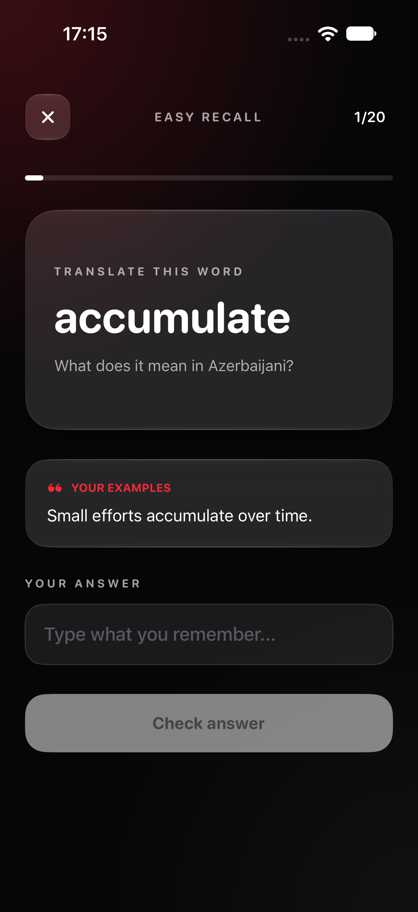
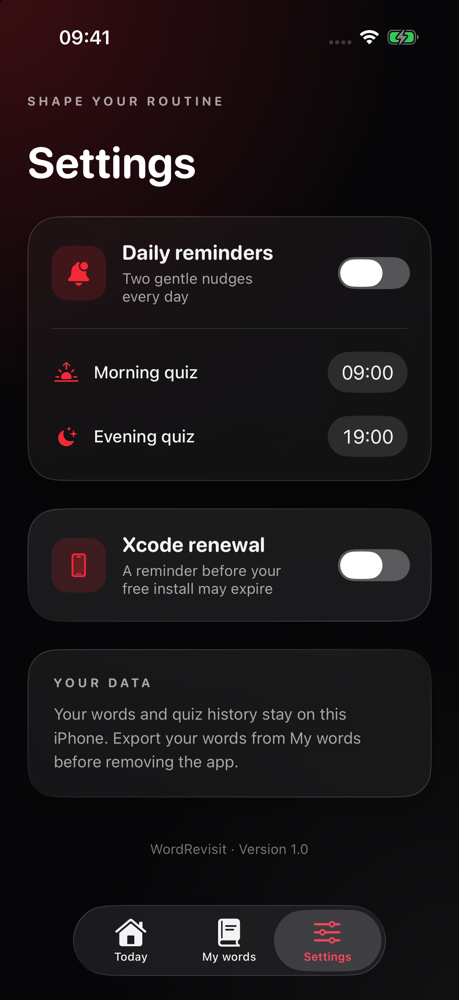

# WordRevisit

An offline iPhone vocabulary app for practising English and Azerbaijani with short, focused quizzes. The first launch contains 59 English words and their Azerbaijani translations. Words, results, and reminder settings stay on the device.

Current version: **1.1.0**. This release keeps each quiz's questions in a fixed order while answers update the word statistics, and shows the WordRevisit logo on the native iOS launch screen.

## Screenshots

Captured from the running iPhone 17 Pro simulator on iOS 26.4. The interface uses Liquid Glass on iOS 26 and a native material fallback on earlier supported releases.

| Today | My words | Quiz | Settings |
|:---:|:---:|:---:|:---:|
|  |  |  |  |

## Features

- **Easy recall:** English word → type its Azerbaijani translation.
- **Hard recall:** Azerbaijani translation → type the English word.
- Azerbaijani answers work with or without Azerbaijani keyboard characters.
- Up to 20 questions per quiz, with words answered incorrectly selected first.
- Add, edit, delete, and search words; optional definitions appear after a quiz answer.
- Import and export words as CSV. A semicolon separates accepted alternative translations.
- Two optional local notifications each day, with times chosen in Settings. No server or account is needed.
- An optional Xcode renewal reminder six days after you mark an install in Settings.
- Light, Dark, and Tinted Home Screen icon variants on iOS 18 and later.
- A centered logo appears during the system launch screen; iOS controls how long it remains visible.

## Run on an iPhone without the App Store

Requirements: a Mac with Xcode 26 or later, an iPhone running iOS 18 or later, a cable, and a free Apple Account.

1. Open `WordRevisit.xcodeproj` in Xcode.
2. In **Xcode → Settings → Accounts**, sign in with your Apple Account.
3. Select the **WordRevisit** target. Under **Signing & Capabilities**, enable **Automatically manage signing**, choose your **Personal Team**, and change the bundle identifier if Xcode asks for a unique one.
4. Connect and unlock your iPhone, select **Trust This Computer** if prompted, and enable **Settings → Privacy & Security → Developer Mode** on the phone if needed.
5. Choose your named iPhone as the Xcode run destination (not **Any iOS Device**) and press **Run** (`⌘R`). Xcode registers the phone and creates its development provisioning profile.
6. If iOS blocks the installed app, open **Settings → General → VPN & Device Management**, select your developer account, and trust its certificate. Follow any restart prompt, then open WordRevisit again.

If Xcode says **“Your team has no devices from which to generate a provisioning profile”**, check that the iPhone appears under **Window → Devices and Simulators**, is unlocked and trusted, and is selected as the run destination. Keep **Automatically manage signing** enabled and select your own Personal Team. If Xcode reports a bundle ID conflict, choose a unique bundle identifier for your copy.

The free Personal Team profile expires after **7 days**. Run the project from Xcode again to renew it. Export your words before removing the app or changing its bundle identifier. See [Apple's device-run guide](https://developer.apple.com/documentation/xcode/running-your-app-on-simulated-or-physical-devices) and [free-account limits](https://developer.apple.com/help/account/basics/about-your-developer-account).

For a heads-up, turn on **Xcode renewal** in Settings. The app sends one local notification six days after the date you enable it or tap **I reinstalled from Xcode**. Tap that button after each successful reinstall. The reminder is an estimate because the app does not inspect your provisioning profile; it cannot renew the install for you.

## Code map

```text
Sources/
├── Models/      Word data, quiz mode, and starter vocabulary
├── Data/        Local JSON persistence and quiz history
├── Services/    Quiz selection, CSV, and local notifications
└── Views/       SwiftUI screens and visual style
```

The project uses SwiftUI, Foundation, and UserNotifications. There are no external packages, accounts, or cloud services. To run the small logic check on a Mac:

```bash
swiftc Sources/Models/*.swift Sources/Services/QuizPlanner.swift Sources/Services/WordCSV.swift Sources/Services/ReminderScheduler.swift Tests/LogicChecks.swift -o /tmp/WordRevisitLogicChecks
/tmp/WordRevisitLogicChecks
```

## License

MIT. See [LICENSE](LICENSE).
